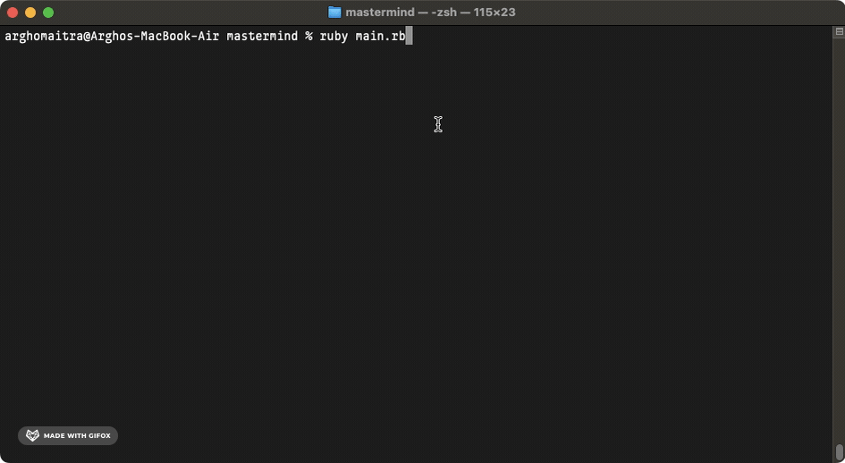
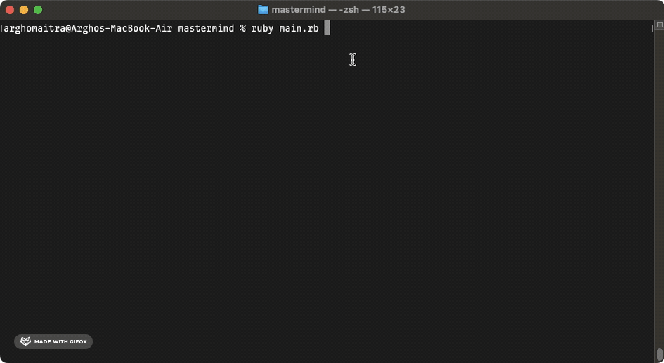

  <h1>Mastermind</h1>

  

  A Command Line Version of Mastermind

## About
`mastermind` is a command line version of the eponymous board puzzle game in which one player tries to guess the code their opponent comes up with. You are given a certain number of turns wherein each turn you get some feedback about how good your guess was - whether it was exactly correct or just the correct color but in the wrong space.[^1]

[^1]: [This project](https://www.theodinproject.com/lessons/ruby-mastermind) is from the [Ruby Course](https://www.theodinproject.com/paths/full-stack-ruby-on-rails/courses/ruby) in [The Odin Project](https://www.theodinproject.com/about).

## Showcase

  
  

  
This is a screen cast of a Human player in the Mastermind game.

  
  

  
This is a screen cast of a Computer player in the Mastermind game.

## Technologies
- ***Git***
- ***CLI***
- ***Ruby***
- ***GitHub***
- ***GitHub Pages***

## Setup & Usage

### Setup
- The Ruby version for this project 3.3.5.
- `bundle install` installs the gems locally.
- `bundle exec ruby [filename]` runs the file.

### Usage
- For local use, users can either [fork](https://docs.github.com/en/pull-requests/collaborating-with-pull-requests/working-with-forks/fork-a-repo) and/or [clone](https://docs.github.com/en/repositories/creating-and-managing-repositories/cloning-a-repository) the repo, or
  - `bundle install` and `bundle exec ruby main.rb` to play the game.
- For remote use, users can try to directly run the game on [replit](https://replit.com/).
  - click on `Run on Replit` and then click on `Confirm and close` to play the game.

## Self Reflections
- > This was the most convoluted and hair pulling project that I have ever done - miles ahead of the difficulty present in [the previous one](https://github.com/ohgrmait/tic_tac_toe). OOP was much harder to structure because of the way this game works - had to use constants, instance variables, classes, inheritance, etc. I made sure to use error handling so that whether the human guesses the code or creates the code - the code gets sanitized as per requirements. There's no doubt that the hardest part was implementing [the Swaszek algorithm](https://puzzling.stackexchange.com/a/8884) that solve the Mastermind game until a set amount of turns. It took several days of brainstorming, pseudocoding and implemetning. It was a wonderful experience altogether so I'm ready to move forward - great project!

## Acknowledgements
- Credit for README goes to [ritaly's README cheatsheet](https://github.com/ritaly/README-cheatsheet) and [ArjunSaili1's comment](https://github.com/TheOdinProject/curriculum/discussions/25472#discussioncomment-5889343).

## Contact and Support
- Please do not hesitate to contact me at ***ohgrmait_02945*** on discord for any project queries.
- This project will no longer be worked upon and no further support will be provided for this project.